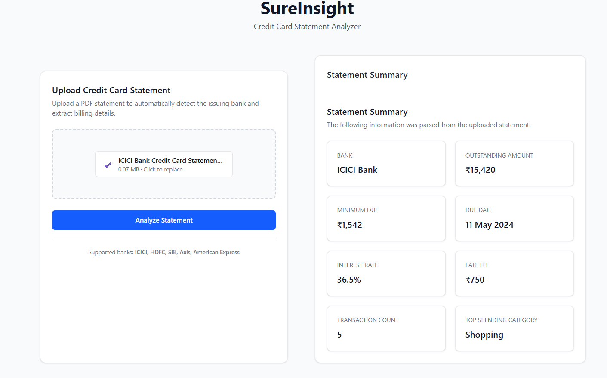

# 🧾 SureInsight – Credit Card Statement Parser

[](https://www.python.org/)
[](https://reactjs.org/)

A full-stack credit card statement parser built with FastAPI (backend) and React (frontend) that transforms PDF statements into structured financial insights.

## 🌟 Features

- 📄 **Upload** credit card PDF statements
- 🏦 **Automatic bank detection** for multiple providers
- 📊 **Comprehensive data extraction** (8+ data points per statement)
- ⚡ **Fast and reliable** parsing with FastAPI
- 🎨 **Clean, responsive UI** built with React and Tailwind CSS
- 🔄 **Real-time** upload and results display
- ❌ **Graceful error handling** for unsupported PDFs

## 🏦 Supported Banks

- ICICI Bank
- HDFC Bank
- SBI Card
- Axis Bank
- American Express

## � Extracted Data Points

- Bank Name
- Outstanding Amount
- Minimum Amount Due
- Payment Due Date
- Interest Rate
- Late Payment Fee
- Transaction Count
- Top Spending Category

## 🖥️ Screenshot


*Figure 1: SureInsight application interface showing the upload panel and parsed statement summary*

## 🛠️ Tech Stack

### Frontend
- React 18+
- Tailwind CSS
- Axios
- Vite

### Backend
- FastAPI
- Python 3.8+
- Uvicorn
- PyPDF2
- Regex

## 🚀 Quick Start

### Prerequisites
- Python 3.8+
- Node.js 16+
- npm or yarn

### Backend Setup
```bash
# Navigate to backend directory
cd backend


# Install dependencies
pip install -r requirements.txt

# Start the server
uvicorn app.main:app --reload
```

### Frontend Setup
```bash
# Navigate to frontend directory
cd frontend

# Install dependencies
npm install

# Start the development server
npm run dev
```

## 📂 Project Structure

```
sureinsight-credit-card-parser/
├── backend/               # FastAPI backend
│   ├── app/              
│   │   ├── routers/      # API routes
│   │   ├── schemas/      # Pydantic models
│   │   ├── services/     # Business logic
│   │   ├── utils/        # Helper functions
│   │   ├── main.py       # FastAPI app entry point
│   │   └── __init__.py
│   └── requirements.txt  # Python dependencies
│
├── frontend/             # React frontend
│   ├── src/
│   │   ├── api/         # API client
│   │   ├── assets/      # Static assets
│   │   ├── components/  # Reusable components
│   │   ├── App.jsx      # Main app component
│   │   └── main.jsx     # Entry point
│   └── package.json
│
├── screenshots/          # Application screenshots
│   └── app-ui.png
│
└── README.md
```

## 🧪 Usage

1. Start both backend and frontend servers
2. Open `http://localhost:5173` in your browser
3. Click "Upload PDF" and select your credit card statement
4. View the parsed results instantly
5. Upload additional statements as needed

## 🎯 Project Goals

- [x] Support 5+ major credit card providers
- [x] Extract 8+ key data points per statement
- [x] Handle real-world PDF formats
- [x] Deliver a polished, user-friendly interface


## 👤 Author

**Ajit Pillai**  
B.Tech – Information Technology  
KJ Somaiya College of Engineering

